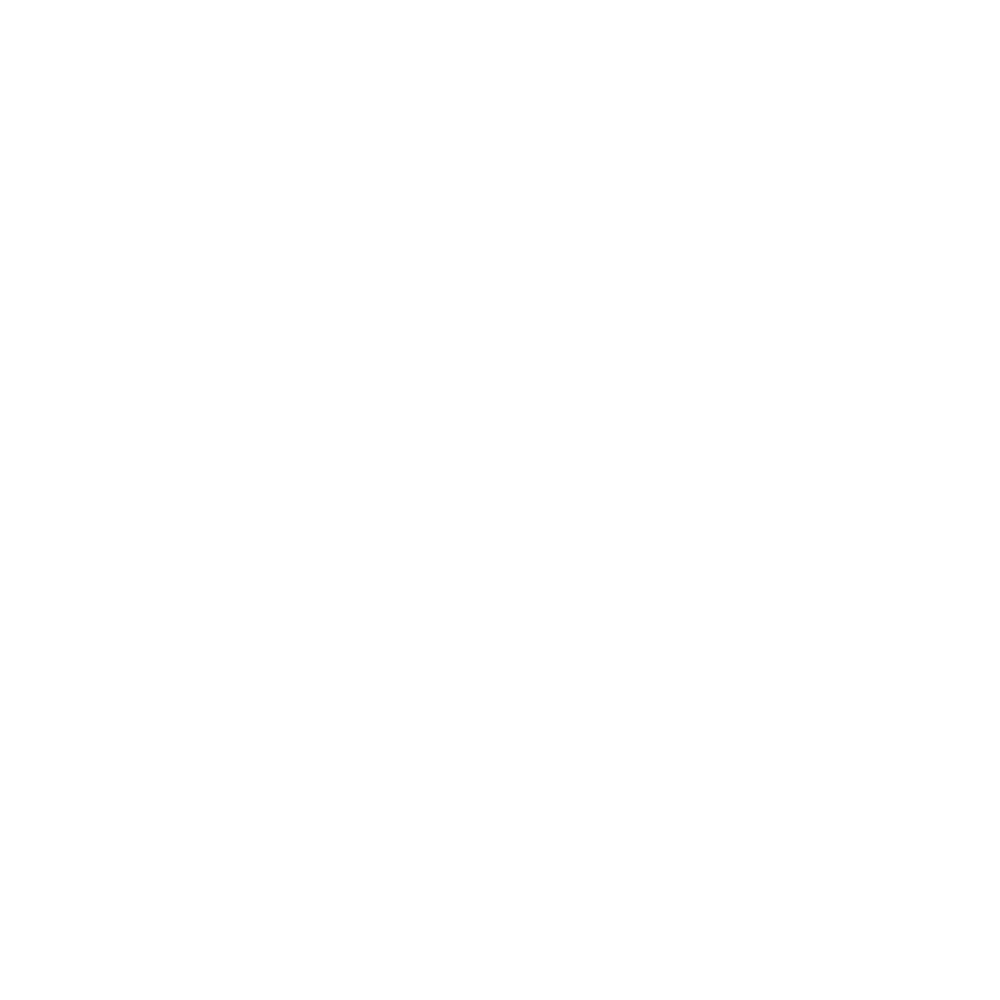

  

<h1 align="center">Defender: Flood Management Website 🌧️🌊</h1>

  Stay informed, stay safe. Real-time weather updates, flood-related news, helpdesk support, and donation options.

---

## 🌟 Features

- **Real-Time Weather Updates**: Get the latest weather information to stay prepared.
- **Flood-Related News**: Access up-to-date news on flood situations in your area.
- **Helpdesk Facility**: Reach out for assistance and support during flood events.
- **Donation Function**: Contribute to relief efforts and help affected communities.

## 🛠️ Getting Started

### Prerequisites

To use Defender effectively, you need:

- A modern web browser.
- Internet connection for real-time updates and news.

## 📖 Usage

1. **🌦️ Weather Updates**: Visit the home page for real-time weather information.
2. **📰 Flood News**: Navigate to the news section to read the latest flood-related updates.
3. **🆘 Helpdesk**: Use the helpdesk feature to get assistance during flood emergencies.
4. **💰 Donate**: Click on the donate button to support flood relief efforts.

## 📜 License

This project is licensed under the MIT License. See the [LICENSE](LICENSE) file for more details.

## 📧 Contact

For any questions or feedback, please open an issue on the repository or contact the project maintainers.

---

Stay Safe, Stay Informed! 🌈

